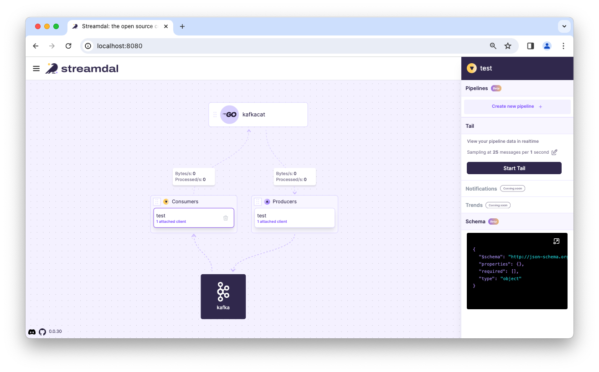
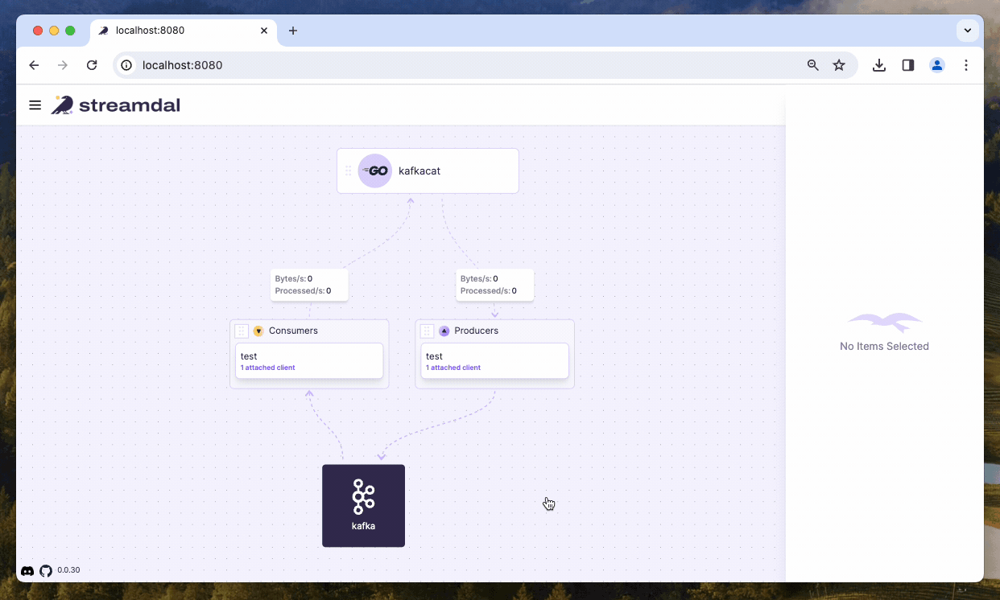

Confluent's Golang Client for Apache Kafka<sup>TM</sup> (instrumented with Streamdal)
=====================================================================================

This library has been instrumented with [Streamdal's Go SDK](https://github.com/streamdal/streamdal/tree/main/sdks/go).

## Getting Started

The following environment variables must be set before launching a producer or consumer:

1. `STREAMDAL_ADDRESS`
    - Address for the streamdal server (Example: `localhost:8082`)
1. `STREAMDAL_AUTH_TOKEN`
    - Authentication token used by the server (Example: `1234`)
1. `STREAMDAL_SERVICE_NAME`
    - How this application/service will be identified in Streamdal Console (Example: `kafkacat`)

By default, the library will not have Streamdal instrumentation enabled; to enable it,
you will need to set `EnableStreamdal` in either 
[`kafka.ReaderConfig`](https://github.com/streamdal/segmentio-kafka-go/blob/main/reader.go#L531) or [`kafka.WriterConfig{}`](https://github.com/streamdal/segmentio-kafka-go/blob/main/writer.go#L334). 

🎉 That's it - you're ready to run the example! 🎉

<sub>For more in-depth explanation of the changes and available settings, see [What's changed?](#whats-changed).</sub>

## Example

A fully working example is provided in [examples/go-kafkacat-streamdal](examples/go-kafkacat-streamdal).

To run the example:

1. Change directory to `examples/go-kafkacat-streamdal`
1. Start a local Kafka instance: `docker-compose up -d`
1. Install & start Streamdal: `curl -sSL https://sh.streamdal.com | sh`
1. Open a browser to verify you can see the streamdal UI at: `http://localhost:8080`
    - _It should look like this:_ 
1. Launch a consumer:
    ```
    STREAMDAL_ADDRESS=localhost:8082 \
    STREAMDAL_AUTH_TOKEN=1234 \
    STREAMDAL_SERVICE_NAME=kafkacat \
    go run go-kafkacat-streamdal.go --broker localhost consume --group testgroup test
    ```
1. In another terminal, launch a producer:
    ```
    STREAMDAL_ADDRESS=localhost:8082 \
    STREAMDAL_AUTH_TOKEN=1234 \
    STREAMDAL_SERVICE_NAME=kafkacat \
    go run go-kafkacat-streamdal.go produce --broker localhost --topic test --key-delim=":"
    ```
1. In the `producer` terminal, produce some data by pasting: `testKey:{"email":"foo@bar.com"}`
1. In the `consumer` terminal, you should see: `{"email":"foo@bar.com"}`
1. Open the Streamdal Console in a browser [https://localhost:8080](https://localhost:8080)
    - _It should look like this:_ 
1. Create a pipeline that detects and masks PII fields & attach it to the consumer
    - 
1. Produce a message in producer terminal: `testKey:{"email":"foo@bar.com"}`
1. You should see a masked message in the consumer terminal: `{"email":"fo*********"}`
    - _**Tip**: If you detach the pipeline from the consumer and paste the same message again, you
      will see the original, unmasked message._

## Passing "runtime" settings to the shim
By default, the shim will set the `ComponentName` to "kafka" and the `OperationName`
to the name of the topic you are producing to or consuming from.

Also, by default, if the shim runs into any errors executing `streamdal.Process()`,
it will swallow the errors and return the original value.

You can change this behavior at runtime by passing a context with a value containing a [`StreamdalRuntimeConfig`](https://github.com/streamdal/segmentio-kafka-go/blob/main/streamdal.go#L27) to
the `ReadMessage(ctx)`, `FetchMessage(ctx)`, and `WriteMessages(ctx, msgs...)` methods.

You can see an example of this in the [go-kafkacat-streamdal example](examples/go-kafkacat-streamdal/main.go#L164).

```go
// StreamdalRuntimeConfig is an optional configuration structure that can be
// passed to kafka.FetchMessage() and kafka.WriteMessage() methods to influence
// streamdal shim behavior.
//
// NOTE: This struct is intended to be passed as a value in a context.Context.
// This is done this way to avoid having to change FetchMessage() and WriteMessages()
// signatures.
type StreamdalRuntimeConfig struct {
	// StrictErrors will cause the shim to return a kafka.Error if Streamdal.Process()
	// runs into an unrecoverable error. Default: swallow error and return original value.
	StrictErrors bool

	// Audience is used to specify a custom audience when the shim calls on
	// streamdal.Process(); if nil, a default ComponentName and OperationName
	// will be used. Only non-blank values will be used to override audience defaults.
	Audience *streamdal.Audience
}
```

## What's changed?

The goal of any shim is to make minimally invasive changes so that the original
library remains backwards-compatible and does not present any "surprises" at
runtime.

The following changes have been made to the original library:

1. `ReaderConfig` and `WriterConfig` have been updated to include a new field: `EnableStreamdal (bool)`
    - This is how you enable the Streamdal instrumentation in the library.
1. `ReadMessage(ctx)`, `FetchMessage(ctx)`, `WriteMessages(ctx, msgs...)` have
    been updated to run `streamdal.Process()` if `EnableStreamdal` is set to `true`
    in either `kafka.ReaderConfig` or `kafka.WriterConfig`.
1. A new file [./streamdal.go](./streamdal.go) has been added to the library that
   contains helper funcs, structs and vars used for simplifying Streamdal
   instrumentation in the core library.
