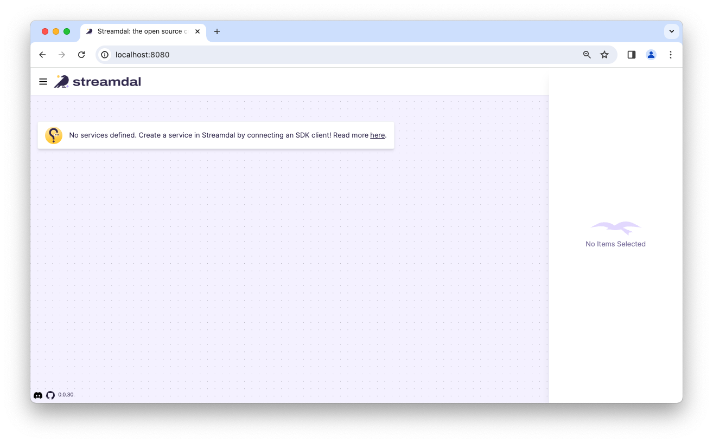

kafka-go (instrumented with Streamdal)
======================================

This library has been instrumented with [Streamdal's Go SDK](https://github.com/streamdal/streamdal/tree/main/sdks/go).

## Getting Started

The following environment variables must be set before launching a producer or consumer:

1. `STREAMDAL_ADDRESS`
    - Address for the streamdal server (Example: `localhost:8082`)
1. `STREAMDAL_AUTH_TOKEN`
    - Authentication token used by the server (Example: `1234`)
1. `STREAMDAL_SERVICE_NAME`
    - How this application/service will be identified in Streamdal Console (Example: `kafkacat`)

By default, the library will not have Streamdal instrumentation enabled; to enable it,
you will need to ... TODO ...

🎉 That's it - you're ready for the example! 🎉

<sub>For more in-depth explanation of the changes and available settings, see [What's changed?](#whats-changed).</sub>

## Example

A fully working example is provided in [examples/go-kafkacat-streamdal](examples/go-kafkacat-streamdal).

To run the example:

1. Change directory to `examples/go-kafkacat-streamdal`
1. Start a local Kafka instance: `docker-compose up -d`
1. Start Streamdal: `curl -sSL https://sh.streamdal.com | sh`
1. Open a browser to verify you can see the streamdal UI at: `http://localhost:8080`
    - _It should look like this:_ 
1. Launch a consumer:
    ```
    STREAMDAL_ADDRESS=localhost:8082 \
    STREAMDAL_AUTH_TOKEN=1234 \
    STREAMDAL_SERVICE_NAME=kafkacat \
    go run go-kafkacat-streamdal.go --broker localhost consume --group testgroup test
    ```
1. In another terminal, launch a producer:
    ```
    STREAMDAL_ADDRESS=localhost:8082 \
    STREAMDAL_AUTH_TOKEN=1234 \
    STREAMDAL_SERVICE_NAME=kafkacat \
    go run go-kafkacat-streamdal.go produce --broker localhost --topic test --key-delim=":"
    ```
1. In the `producer` terminal, produce some data by pasting: `testKey:{"email":"foo@bar.com"}`
1. In the `consumer` terminal, you should see: `{"email":"foo@bar.com"}`
1. Open the Streamdal Console in a browser [https://localhost:8080](https://localhost:8080)
    - _It should look like this:_ 
1. Create a pipeline that detects and masks PII fields & attach it to the consumer
    - 
1. Produce a message in producer terminal: `testKey:{"email":"foo@bar.com"}`
1. You should see a masked message in the consumer terminal: `{"email":"fo*********"}`
    - _**Tip**: If you detach the pipeline from the consumer and paste the same message again, you
      will see the original, unmasked message._

## What's changed?

TODO
